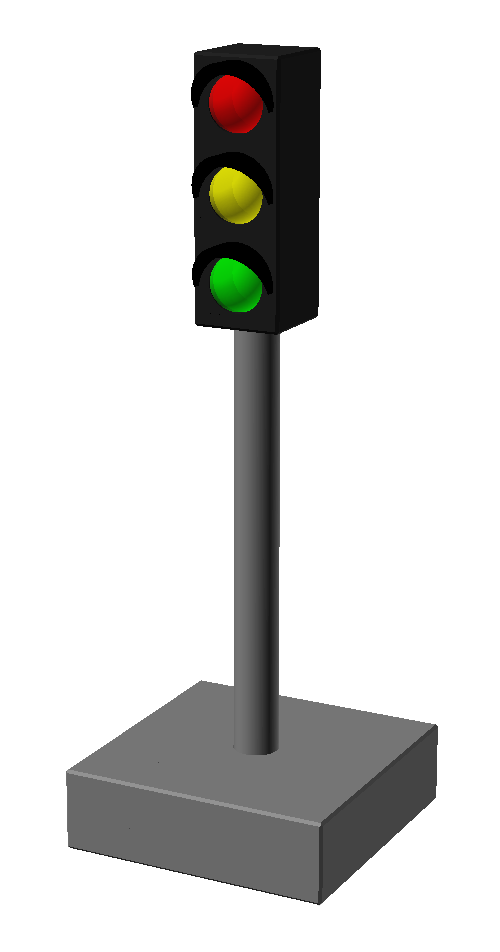
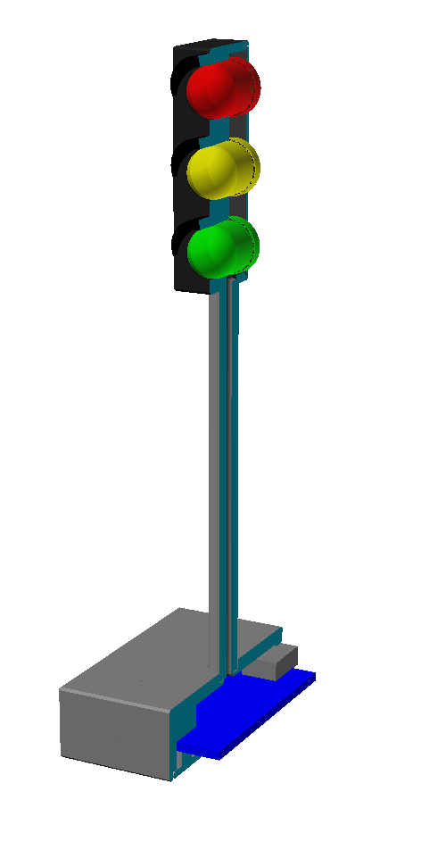
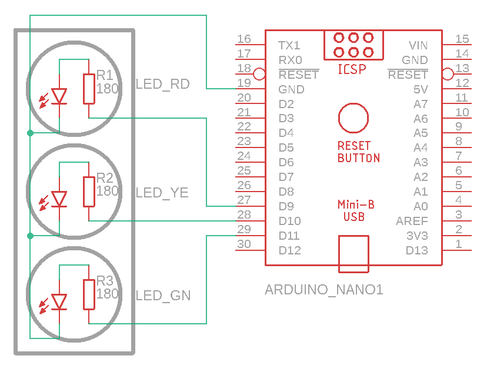

# StopLight

This project is a 3D-printable stop light intended as build state indicator.

## 3D model

<div style="text-align:center"></div>

The model is created with [OpenSCAD](https://openscad.org/) and is made in a parametric way.

The following model parameters can easily be changed:
- Amount of LEDs
- En/Disable the sun shades above the LEDs
- The inner diameter of the pole for running cables
- The length of the pole
- Making the pole an independent object (allows to print in a different orientation for more stability)

There are also parameters to hide and enable certain parts of the model to simplify the export process.

Additionally there are some visualization tools:
- Show the LEDs in the model
- Show the Arduino Nano
- A cross section of the entire model to view the internal setup

<div style="text-align:center"></div>

## Bill of materials

These things are needed in order to assemble one of these stop lights
- [Arduino Nano](https://store.arduino.cc/products/arduino-nano) or a compatible board as the main brain of the stop lights
- LEDs with 10mm diameter (3 by default in red, yellow and green)
- One 180 Ohms resistor for each of the LEDs

Depending on where you buy these things this will run you about 5 to 20 € for the 3 LED variant.

Additionally you will need a soldering station, solder, some thin wires (preferably thread wire) and the material to 3D print the model.

## Assembly

At first you need to print all the parts for your stop light.

Then start with super gluing the pole to the housing and the base of the stop light.

<div style="text-align:center"></div>

Then add the LEDs from top to bottom. Keep all the cathodes on one side, so you can simply solder them all together and only need a single ground wire from the top to the base. The resistors are best added to the anode pin of the LEDs.

Once all the LEDs are wired and the connected to the Arduino Nano test them once before gluing them in place with super glue and then add the back panel of the stop light.
Then put the Arduino in the base and close the door.

## Software

This section gives insights about the default [StopLight_3](https://github.com/SchmidtBytes/StopLight/blob/main/programs/StopLight_3/StopLight_3.ino) program.
Other programs might add or delete features.

The programs are all written using the [Arduino IDE](https://www.arduino.cc/en/Main/Software_).

### LED usage

The LEDs are connected to the PWM pins of the Arduino so they can be used as digital and analog outputs.
They are wired in a way so that HIGH is LED on and LOW is LED off.

You can either write a digital value by using the digitalWrite command.

```c
digitalWrite(LED_RD, HIGH); // Turn the red LED on
digitalWrite(LED_GN, LOW);  // Turn the green LED off
```

Or you can also use the analogWrite command and set a value between 0 and 255.

```c
analogWrite(LED_YE, 127); // Set the yellow LED to half brightness
```

### Serial interface

The serial interface is connected via the USB port.
By default the baud rate is set to **38400**.
The Arduino will cyclically check for new commands on the serial interface and adapt its internal state machine.

### Commands

The commands are currently one letter codes for the various states.
The state will change if the code is known and the requested state is not already active.

| code | state          | description                                    |
|-----:|:--------------:|:----------------------------------------------|
| i    | STATE_INIT     | Initialization animation                      |
| o    | STATE_OFF      | Turn off all of the LEDs                      |
| b    | STATE_BUILDING | Flash the yellow LED, but dim the transitions |
| s    | STATE_SUCCESS  | Light up only the green LED                   |
| u    | STATE_UNSTABLE | Light up only the yellow LED                  |
| f    | STATE_FAILED   | Light up only the red LED                     |
| p    | STATE_PREPARE  | Light up both yellow and red                  |
| n    | STATE_NIGHT    | flash the yellow light, but with no dimming   |
| c    | STATE_CYCLE    | run a normal stop light animation             |

The stop light will accept the state codes both in upper and lower case letters.

### Sleep mode

Sleep mode is a feature to turn off the stop light LEDs after a certain amount of time has passed.
After this the stop light will automatically switch to **STATE_OFF**, but will continue to listen for commands.
By default this is set to 1 hour after receiving the last command.

### Libraries

As of now no external libraries are needed.

## Usage

The usage of the stop light is rather simple.
All typical operating systems come with the necessary drivers.
First you need to set the right baud rate to the serial interface (38400 by default).
In order to set the state just write the letter for the desired state to the serial interface.

From the Linux shell you can simply set the state with this command:

``` shell
echo s > /dev/ttyUSB0
```

## Contribution

Feel free to share and upload your own ideas and features.
